# 🚀 Noir Browser - QuickStart: Reconstrucción Completa

> **Objetivo:** Transformar Noir Browser en un motor ultra-rápido con ADN Chrome × Tor + Vulkan 1.3

---

## 📋 Requisitos Previos

```powershell
# 1. Rust toolchain (1.75+)
rustup update stable
rustc --version  # >= 1.75

# 2. Vulkan SDK 1.3+ (Windows)
# Descargar desde: https://vulkan.lunarg.com/sdk/home#windows
# Verificar instalación:
vulkaninfo --summary | findstr "apiVersion"  # Debe mostrar >= 1.3

# 3. Git (para clonar/actualizar)
git --version

# 4. Windows: Habilitar modo desarrollador (opcional, para symlinks)
# Configuración → Actualización y seguridad → Para desarrolladores
```

---

## 🗑️ Paso 0: Limpieza de Archivos Legacy

```powershell
cd C:\Users\andre\OneDrive\Desktop\Noir_Browser\No-Chromium

# Eliminar archivos que NO encajan con la nueva arquitectura:
Remove-Item -Path "src/old_render/*" -Recurse -Force 2>$null
Remove-Item -Path "src/deprecated/*" -Recurse -Force 2>$null
Remove-Item -Path "src/v8_bindings/*" -Recurse -Force 2>$null  # Ya no usamos V8

# Mantener solo lo esencial:
# ✓ src/parsers/ (HTML/CSS nativos)
# ✓ src/browser/ (lógica de navegación)
# ✓ src/vulkan_engine/ (nuevo motor GPU)
# ✓ src/network/ (fetch + privacidad)
```

---

## ⚙️ Paso 1: Actualizar Dependencias

```powershell
# El nuevo Cargo.toml ya está en la raíz del workspace.
# Verificar que No-Chromium/Cargo.toml tenga:

[dependencies]
# Core
tokio = { workspace = true }
ash = { workspace = true }
gpu-allocator = { workspace = true }

# Parsing
nom = { workspace = true }

# JS Engine (Boa - nativo Rust)
boa_engine = { workspace = true }

# Privacy
zeroize = { workspace = true }

# Networking
reqwest = { workspace = true, features = ["socks"] }

# Features para builds personalizados:
# cargo build --features "privacy tor_mode ultrafast"
```

---

## 🔧 Paso 2: Compilar Fase 0 (Vulkan Engine)

```powershell
cd C:\Users\andre\OneDrive\Desktop\Noir_Browser\No-Chromium

# Build con validation layers (debug)
cargo build --features "debug_vulkan" --bin noir_browser

# Ejecutar test de inicialización Vulkan
cargo test test_vulkan_init --features "debug_vulkan" -- --nocapture

# Si todo está bien, deberías ver:
# ✓ Vulkan instance created
# ✓ Physical device selected: [Tu GPU]
# ✓ Swapchain created: 1920x1080
# ✓ Timeline semaphore supported
```

### 🔍 Solución de Problemas Comunes

| Error | Causa Probable | Solución |
|-------|---------------|----------|
| `VK_ERROR_INITIALIZATION_FAILED` | Vulkan SDK no detectado | Reinstalar Vulkan SDK, verificar PATH |
| `VK_ERROR_EXTENSION_NOT_PRESENT` | Falta extensión Win32 surface | Instalar Vulkan SDK con componentes de Windows |
| `Out of memory` | GPU con <4GB VRAM | Usar feature `lightweight` para modo single-process |
| `Validation layer error` | Debug layers activadas | Normal en debug; en release usar `--features ultrafast` |

---

## 🎯 Paso 3: Ejecutar Benchmark Inicial

```powershell
# Medir frame time baseline
cargo bench --bench frame_time --features "ultrafast"

# Resultado esperado (Fase 0):
# frame_time: 8-12ms (60-125 FPS)
# memory_usage: <100MB por tab
# cpu_usage: <2% idle

# Si ves >16ms/frame, revisar:
# 1. ¿Están activadas las validation layers? (desactivar en release)
# 2. ¿Triple buffering está funcionando? (ver logs)
# 3. ¿GPU está en modo rendimiento? (configurar NVIDIA/AMD control panel)
```

---

## 🧪 Paso 4: Test de Privacidad (Tor Mode)

```powershell
# Compilar con modo privacidad + Tor
cargo build --features "privacy tor_mode" --release

# Ejecutar con proxy SOCKS5 local (ej. Tor running en :9050)
./target/release/noir_browser.exe --proxy socks5://127.0.0.1:9050

# Verificar aislamiento:
# 1. Abrir dos tabs: example.com y tracker-test.com
# 2. Inspeccionar cookies: deben estar partitioned por first-party
# 3. Ejecutar fingerprint test: https://coveryourtracks.eff.org
#    → Canvas fingerprint debe tener jitter aplicado
```

---

## 📁 Estructura Resultante

```
Noir_Browser/
├── ARCHITECTURE.md          # 🧬 Diseño fusionado Chrome×Tor+Vulkan
├── Cargo.toml               # ⚙️ Workspace con features
├── Fases.md                 # 🗺️ Roadmap 7 fases (20 semanas)
├── QUICKSTART.md            # 🚀 Este archivo
│
└── No-Chromium/
    ├── Cargo.toml           # Dependencias del motor
    ├── src/
    │   ├── main.rs          # Entry point + process model selector
    │   ├── app.rs           # UI loop (winit)
    │   ├── browser/         # Navegación + privacy (FPI)
    │   ├── renderer/        # Parser + layout + Boa JS
    │   ├── vulkan_engine/
    │   │   └── core.rs      # 🎮 UltraFastVulkanEngine (Fase 0)
    │   └── network/         # Fetch + SOCKS5 + DoH
    │
    └── tests/
        ├── wpt/             # Web Platform Tests
        ├── privacy/         # Fingerprint tests
        └── performance/     # Frame time benchmarks
```

---

## 🎯 Checklist: "Mínimo Producto Utilizable" (Post-Fase 1)

Un usuario debería poder:

- [x] Navegar a `https://example.com` y ver contenido renderizado
- [x] Hacer clic en enlaces y navegar entre páginas
- [x] Usar tema oscuro inteligente (Noir Dark Theme)
- [x] Abrir/cerrar tabs sin memory leaks
- [x] Usar atajos: `Ctrl+T`, `Ctrl+W`, `Ctrl+L`, `F5`
- [ ] Ejecutar scripts simples: `console.log()`, manipulación DOM básica *(Fase 2)*
- [ ] Navegar con proxy SOCKS5 (modo Tor) *(Fase 5)*
- [ ] Ver resultados de búsqueda local en overlay *(Fase 7)*

---

## 🔄 Flujo de Desarrollo Recomendado

```mermaid
graph LR
    A[Fase 0: Vulkan Engine] --> B[Fase 1: Zero-Copy Pipeline]
    B --> C[Fase 2: Boa JS + DOM Bridge]
    C --> D[Fase 3: Privacy FPI + Anti-Fingerprint]
    D --> E[Fase 4: Multi-Process + IPC]
    E --> F[Fase 5: Tor Mode + Circuit Rotation]
    F --> G[Fase 6: Flexbox/Grid + MSDF]
    G --> H[Fase 7: Búsqueda Nativa + Overlay]
    
    style A fill:#90EE90
    style H fill:#FFB6C1
```



**Enfócate 100% en la Fase actual.** No saltes fases: sin Vulkan ultra-fast, las demás características no importan.

---

## 🤝 ¿Necesitas Ayuda?

### Debuggear Vulkan
```powershell
# Activar logs detallados
$env:RUST_LOG="noir_browser::vulkan=trace"
cargo run --features "debug_vulkan"

# Usar RenderDoc para capturar frames
# Descargar: https://renderdoc.org/
# Capturar frame → Analizar draw calls, memory usage, pipeline state
```

### Contribuir Código
```powershell
# Crear rama para tu feature
git checkout -b feature/vulkan-zero-copy

# Ejecutar tests antes de push
cargo test --all-features
cargo clippy --all-features -- -D warnings

# Commit con mensaje convencional
git commit -m "feat(vulkan): implement zero-copy staging buffer"
```

### Reportar Bugs
1. Incluir: `cargo --version`, `vulkaninfo --summary`, GPU model
2. Adjuntar: logs con `RUST_LOG=trace`, screenshot si es visual
3. Usar template: `.github/ISSUE_TEMPLATE/bug_report.md`

---

> **💡 Consejo Pro:** Usa `cargo watch -x run --features debug_vulkan` para hot-reload durante desarrollo.
> 
> **⚠️ Advertencia:** No uses `--release` con `debug_vulkan` activado. Las validation layers son solo para desarrollo.

---

## 🚀 ¡Comienza Ahora!

```powershell
# 1. Verificar entorno
vulkaninfo --summary | findstr "apiVersion"

# 2. Compilar Fase 0
cd C:\Users\andre\OneDrive\Desktop\Noir_Browser\No-Chromium
cargo build --features "debug_vulkan"

# 3. Ejecutar
cargo run --features "debug_vulkan"

# 4. ¡Ver Noir Browser renderizando con Vulkan puro! 🎮✨
```

**Próximo hito:** Cuando veas `frame_time: <8ms` en los logs, estás listo para la Fase 1.

¡Éxito en la reconstrucción! 🦀⚡🌌
