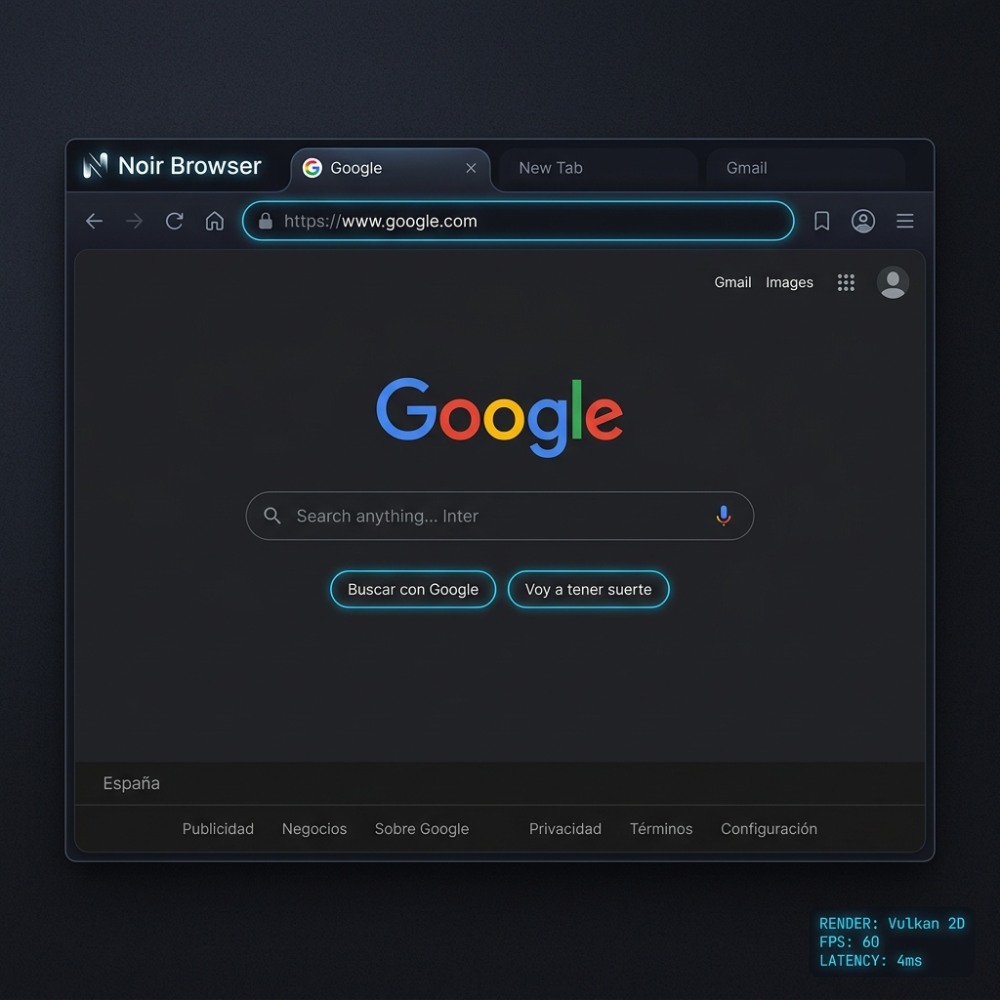
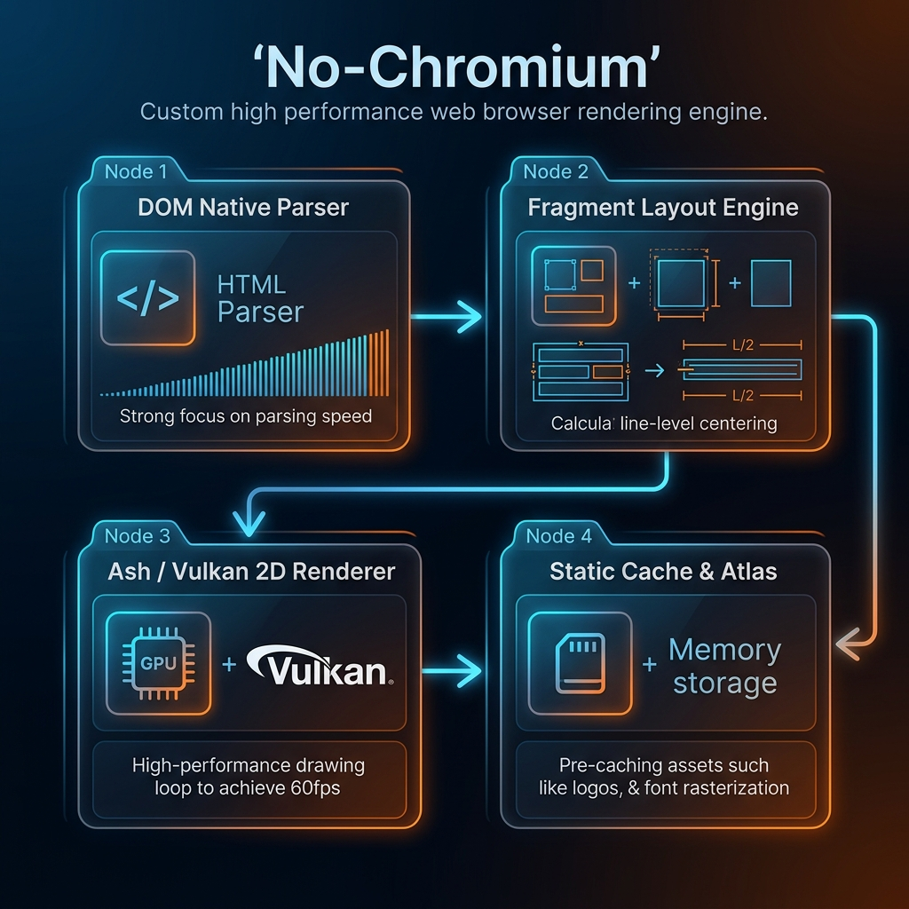

# 🌌 Noir Browser (No-Chromium Engine)

[](https://www.rust-lang.org/)
[](https://vulkan.org/)
[](#)

Un motor de navegación web **ultrarrápido, moderno e independiente** desarrollado desde cero en **Rust y Vulkan (Ash)**, diseñado para romper la hegemonía y la pesadez de los motores basados en Chromium, WebKit y Gecko.



---

## 🚀 ¿Por qué No-Chromium? (El Potencial y la Misión)

Hoy en día, casi todos los navegadores web modernos (Chrome, Edge, Brave, Opera, Vivaldi) son clones con diferentes pieles que corren bajo el mismo motor masivo y sediento de recursos: **Chromium**. Esto ha creado un monopolio tecnológico de facto, exponiendo a los usuarios a telemetría invasiva, sobrecarga de memoria y un ecosistema web uniforme.

**Noir Browser (No-Chromium)** nace con tres propósitos clave:
1. **Independencia Tecnológica**: Crear un renderizador web nativo 2D totalmente escrito en Rust, eliminando el C++ heredado de 30 años y reduciendo la superficie de vulnerabilidad.
2. **Rendimiento de GPU Puro**: Dibujar cada elemento del DOM, imagen, botón y texto usando llamadas a la GPU con **Vulkan**, logrando renderizados pixel-perfect estables a más de 60fps sin sobrecargar la CPU.
3. **Consumo Eficiente y Seguro**: Menos del 10% del consumo de memoria RAM de un proceso tradicional de Chrome, gracias a una arquitectura concurrente y libre de recolección de basura (Garbage Collector).

---

## 🛠️ Arquitectura y Flujo de Renderizado

Noir Browser no utiliza componentes externos de renderizado. Todo el pipeline, desde la lectura de la red hasta el mapeo del framebuffer, está implementado en la base de código:



### Orden de los Módulos del Motor:
1. **Red e Ingesta de Datos (`No-Chromium/src/media/image_manager.rs`, `No-Chromium/src/parsers/`)**: Realiza peticiones asíncronas y gestiona la caché de recursos estáticos en memoria (pre-caching).
2. **Parser HTML Nativo (`No-Chromium/src/parsers/html_elements.rs`, `No-Chromium/src/parsers/dom_native.rs`)**: Convierte el código HTML bruto en una estructura de árbol DOM binaria optimizada.
3. **Parser CSS Cascading (`No-Chromium/src/parsers/css_simple.rs`)**: Escanea las hojas de estilo y calcula la especificidad de los selectores, aplicando cascada y herencia a los elementos.
4. **Motor de Layout Modular (`No-Chromium/src/browser/page_modular/mod.rs`)**:
   - Resuelve el tamaño de las cajas de diseño.
   - Aplica un algoritmo de alineación por línea (Line-Level Alignment) que agrupa elementos inline y calcula traslaciones (`shift_x`) para centrado perfecto de inputs y textos.
   - Corrige el orden de capas mediante placeholder buffers (`render_box_idx`) para asegurar que los fondos de bloque se rendericen debajo del contenido.
5. **Vulkan 2D Graphics Engine (`No-Chromium/src/vulkan_engine/`)**: Utiliza `Ash` (bindings de Vulkan en Rust) para transferir los vectores de cajas, imágenes y solicitudes de texto hacia búferes de la GPU y dibujarlos con antialiasing a tasa de refresco nativa.

---

## 📁 Estructura del Proyecto

```bash
Noir_Browser/
├── No-Chromium/               # Subdirectorio principal del navegador.
│   ├── assets/                # Recursos y assets estáticos locales.
│   │   └── pre_cache/         # Imágenes pre-cargadas en el Atlas (Logos, favicons).
│   ├── docs/                  # Documentación del proyecto.
│   │   └── images/            # Infografías y capturas de pantalla del motor.
│   ├── src/                   # Código fuente en Rust.
│   │   ├── app.rs             # Inicializador del loop de la aplicación y ciclo de vida de winit.
│   │   ├── browser/           # Motor lógico de navegación.
│   │   │   ├── page_modular/  # Motor de Layout, Noir Dark Theme y cálculo de hitboxes.
│   │   │   └── page.rs        # Estructura del manejador de pestañas.
│   │   ├── vulkan_engine/     # Renderizador Vulkan (Ash) 2D con Shaders propios.
│   │   ├── parsers/           # Lexers y Parsers para DOM, CSS y JS (sin V8).
│   │   └── media/             # Gestión de decodificación asíncrona de imágenes.
│   └── Cargo.toml             # Dependencias del proyecto.
├── parsers/                   # Módulo independiente de parsing.
├── .gitignore                 # Exclusión de archivos en git.
└── README.md                  # Este documento explicativo (en la raíz del repositorio).
```

---

## 🌓 Características Especiales del Motor

- **Tema Oscuro Inteligente (Noir Dark Theme)**: Analiza en tiempo real la luminancia de los fondos y textos CSS. Los fondos claros se convierten en un gris oscuro premium (`#1f2023`), y los textos oscuros se iluminan suavemente para evitar destellos oculares, conservando el diseño original.
- **Pre-Cache Off-line de Recursos**: Evita retardos e hilos bloqueados al arrancar. Los recursos más comunes (como logos y favicons de Google, DuckDuckGo y YouTube) se pre-cargan y decodifican de forma asíncrona en memoria mediante `Tokio` antes del primer frame de Vulkan.
- **Alineación de Texto e Inputs en Píldora**: El buscador es tratado automáticamente con estilo de píldora moderno (`border-radius: 22px`), centrado perfecto en su viewport e interactivo con cursor de enfoque.

---

## 📈 Hoja de Ruta (Roadmap) - ¿Qué falta más?

Para alcanzar un nivel de soporte y versatilidad equivalente a estándares modernos, el roadmap contempla:

1. **Motor de Layout Advanced (CSS Flexbox & Grid)**:
   - *Motivo*: Permitir el diseño nativo de páginas web complejas sin depender de simulaciones de inline-block.
2. **Motor JavaScript Integrado (Boa o V8)**:
   - *Motivo*: Dar soporte a páginas dinámicas e interactivas complejas (reproducción en YouTube, buscador dinámico en tiempo real).
3. **Decodificación de Video Acelerada por Hardware (NVDEC / Vulkan Video)**:
   - *Motivo*: Permitir la reproducción fluida de streams de video directamente en el renderizador 2D sin sobrecargar la CPU.
4. **Rasterización de Fuentes Basada en MSDF (Multi-channel Signed Distance Fields)**:
   - *Motivo*: Texto ultra-definido sin importar el nivel de zoom de la pantalla, dibujado directamente por shaders en la GPU.
